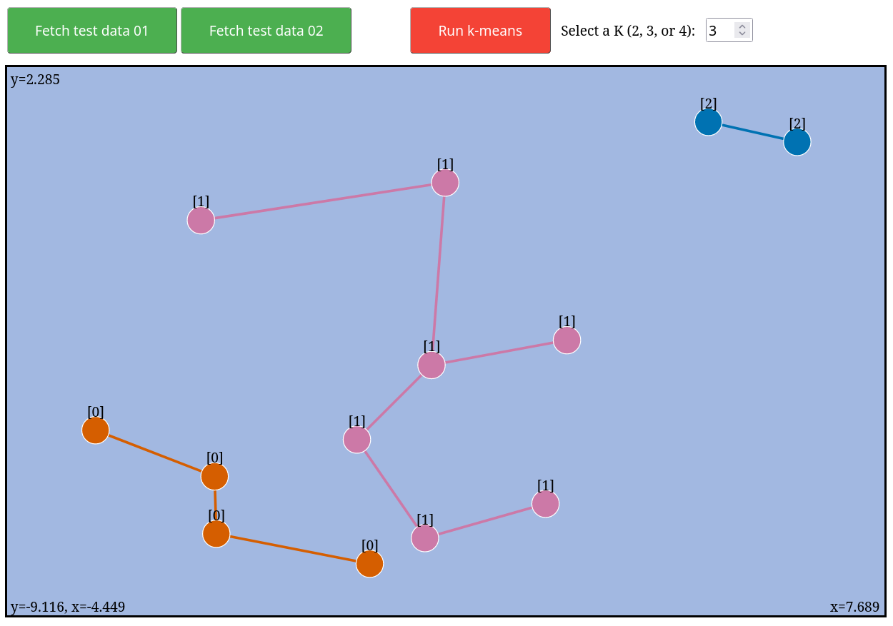

# D3 Demo


## :black_circle: Resources
- [Backend: FastAPI](https://fastapi.tiangolo.com/)
- [Frontend: D3](https://d3js.org/)

## :large_blue_circle: Install
- Always develop within a virtual environment to prevent dependency version conflicts:
```bash
python -m venv venv
source venv/bin/activate
```

- Make sure your PIP version is updated within the virtual environment:
```bash
python -m pip install -U pip
```

- While developing, install your package in `editable` mode; this enable testing tools fetching the latest version of source your code:
```bash
python -m pip install -e "."
```

## :red_circle: Run
After installing, start the backend in debugging mode:
```bash
python -m uvicorn main:app --reload
```
Then, open `index.html` using your favorite web browser. :rocket:
